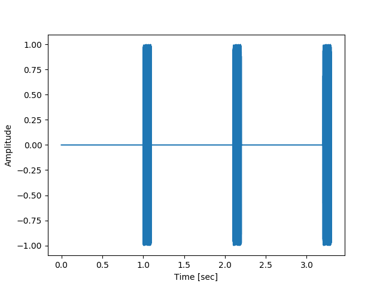
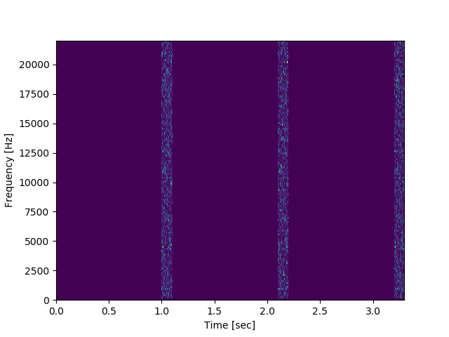

# AudioStim
Simple Python class to generate artificial auditory stimuli such as pure tones, chirps and noise.

## Requirements
The dependencies are:
- numpy,
- scipy and
- matplotlib.

To install them if you do not already have them installed, you can run the following in a terminal/command window 
from the directory containing `requirements.txt`:

```
pip install -r requirements.txt
```

## Usage
The `example.py` file describes how to create a `Stimulus` object:

```python
from Stimulus import Stimulus

# Define length of stimulus in seconds and sampling rate in samples/second
length = 0.1
fs = 44100

# Initialise Stimulus object with given length and sampling rate
s = Stimulus(length, fs)
```

### Generating the stimulus
You can choose to generate:
- a pure tone
    ```python
    # Define frequency of tone
    f = 1000
    
    # Generate tone
    s.pure_tone(f)
    ```
- a frequency sweep
    ```python
    # Define start and stop frequency of sweep
    start = 0
    stop = 1000
    
    # Generate frequency sweep
    s.chirp(start,stop)
    ```
- silence
    ```python
    # Generate silence
    s.silence()
    ```
- white noise
    ```python
    # Generate white noise
    s.noise()

Note that the methods `pure_tone()`, `chirp()`, `silence()` and `noise()` will overwrite whatever is stored 
as data in the object.

### Adding `Stimulus` objects
You can add `Stimulus` objects with the `+` operator. In the example, we generate a noise stimulus and add it
to a stimulus with silence.

```python
# Generate noise and silence and add them together
fs = 44100

noise_length = 0.1
silence_length = 1


noise = Stimulus(noise_length, fs)
noise.noise()

silence = Stimulus(silence_length, fs)
silence.silence()

stim = silence + noise
```

### Repeating a stimulus
A stimulus can be repeated with the `*` operator:

```python
repeated_stim = 3 * stim
```

## Visualising the stimulus
You can plot the waveform and the spectrogram of the stimulus using the `plot_waveform()`
and `plot_spectrogram()` methods respectively:

```python
repeated_stim.plot_waveform()
repeated_stim.plot_spectrogram()
```




## Saving the stimulus
Stimuli can be saved into `wav` files using the `save_wav()` method:

```python
repeated_stim.save_wav('filename.wav')
```

By default, stimuli are as 16-bit files, but it is possible to select 32-bit:
```python
repeated_stim.save_wav('filename.wav', bit_depth='32')
```
